# dragon-radar

The aim of this project is to describe how I have created a reproduction of the dragon radar based on a Raspberry Pi Zero.
A video preview is available here:  https://www.youtube.com/shorts/0jsaYxSqkwQ

## Drawing
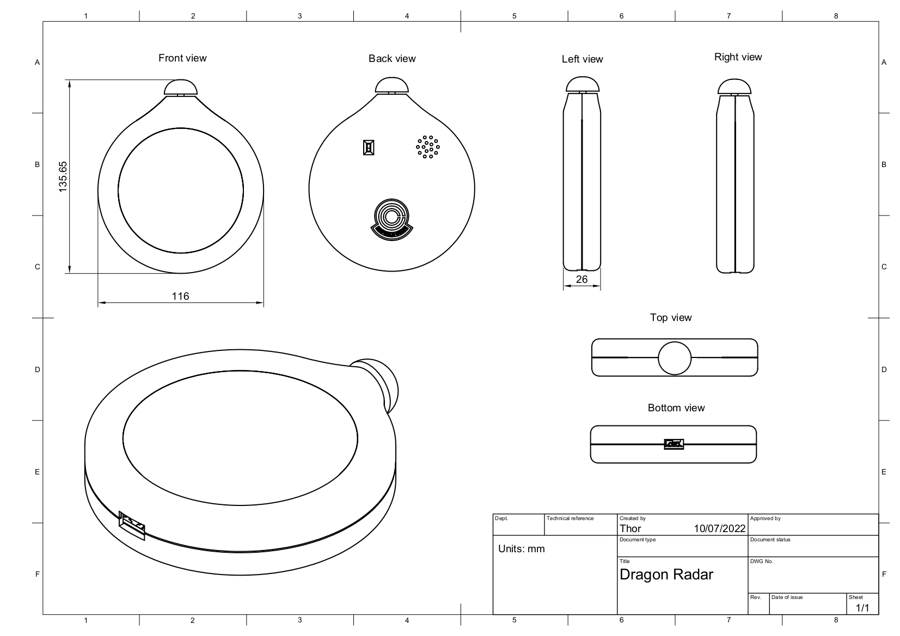

## Hardware

### Bill or materials

| Component | Note | The place where I got it |
| --------- | ---- | ------------------------ |
| Raspberry Pi Zero | Any Raspberry Pi Zero supplier ||
| SDCard | An SDCard for the Raspberry Pi Zero ||
| screen + driver | Be careful, there are different models of the driver pcb (the dimensions can be different). I personally got this version: 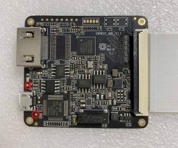 | [Link](https://fr.aliexpress.com/item/4000543786784.html?spm=a2g0o.productlist.0.0.3e422d98EyQn09&algo_pvid=58d8c4ea-0240-4de5-9285-a339fac76b9d&algo_exp_id=58d8c4ea-0240-4de5-9285-a339fac76b9d-8&pdp_ext_f=%7B%22sku_id%22%3A%2210000002795216032%22%7D&pdp_npi=2%40dis%21EUR%21%2171.11%2194.83%21%21%21%21%400b0a182b16573979907571372eb2f4%2110000002795216032%21sea) |
| battery || [Link](https://www.ebay.fr/itm/Li-Po-Li-polymer-rechargeable-Battery-ion-3-7V-900-mAh-902040-for-GPS-MP5/254362430726?ssPageName=STRK%3AMEBIDX%3AIT&_trksid=p2060353.m2749.l2649) |
| battery charger + boost || [Link](https://www.adafruit.com/product/1944) |
| power switch || [Link](https://www.adafruit.com/product/805) |
| speaker | 8ohm speaker (max diameter 17mm)| [Link](https://fr.aliexpress.com/item/4000511202149.html?spm=a2g0o.productlist.0.0.1c0d5648HMRr3c&algo_pvid=e8f56088-ff4f-4b26-9f34-9833aa519252&aem_p4p_detail=2022070913463412676755368296810037339867&algo_exp_id=e8f56088-ff4f-4b26-9f34-9833aa519252-2&pdp_ext_f=%7B%22sku_id%22%3A%2210000002490986129%22%7D&pdp_npi=2%40dis%21EUR%21%210.63%210.65%21%212.48%21%21%400b0a187916573995947685404e222b%2110000002490986129%21sea) |
| push button | MSP121CSW momentary switch | [Link](https://fr.rs-online.com/web/p/boutons-poussoirs/1336502) |
| mini hdmi connector || C1 from [Link](https://fr.aliexpress.com/item/4000014554460.html?spm=a2g0o.productlist.0.0.6c462670tgQ4ly&algo_pvid=ea4fa7b5-1e2b-43ce-b382-1920ecd65f2d&aem_p4p_detail=2022070914034712219789050274150037514177&algo_exp_id=ea4fa7b5-1e2b-43ce-b382-1920ecd65f2d-1&pdp_ext_f=%7B%22sku_id%22%3A%2212000021640768879%22%7D&pdp_npi=2%40dis%21EUR%21%212.23%212.23%21%21%21%21%400b0a182b16574006277181244eb2f4%2112000021640768879%21sea) |
| hdmi connector || A1 from [Link](https://fr.aliexpress.com/item/4000014554460.html?spm=a2g0o.productlist.0.0.6c462670tgQ4ly&algo_pvid=ea4fa7b5-1e2b-43ce-b382-1920ecd65f2d&aem_p4p_detail=2022070914034712219789050274150037514177&algo_exp_id=ea4fa7b5-1e2b-43ce-b382-1920ecd65f2d-1&pdp_ext_f=%7B%22sku_id%22%3A%2212000021640768879%22%7D&pdp_npi=2%40dis%21EUR%21%212.23%212.23%21%21%21%21%400b0a182b16574006277181244eb2f4%2112000021640768879%21sea) |
| hdmi ribbon | 50mm | Only FFC -5cm from [Link](https://fr.aliexpress.com/item/4000014554460.html?spm=a2g0o.productlist.0.0.6c462670tgQ4ly&algo_pvid=ea4fa7b5-1e2b-43ce-b382-1920ecd65f2d&aem_p4p_detail=2022070914034712219789050274150037514177&algo_exp_id=ea4fa7b5-1e2b-43ce-b382-1920ecd65f2d-1&pdp_ext_f=%7B%22sku_id%22%3A%2212000021640768879%22%7D&pdp_npi=2%40dis%21EUR%21%212.23%212.23%21%21%21%21%400b0a182b16574006277181244eb2f4%2112000021640768879%21sea) |
| audio filter + amplifier | see below ||

### Audio filter + Amplifier
Unfortunately the Raspberry Pi Zero doesn't offer an easy way to send audio output to an extrenal speaker.
An audio signal can be retrieved from the GPIO 18. This signal must be filtered and amplified before being sent to a speaker.
I have designed a specific PCB to perform these tasks.

**Kicad project**

[audio-pcb-kicad-project.zip](./audio-pcb/audio-pcb-kicad-project.zip)

**Bill of materials**
| Component | Number | Package |
| --------- | ------ | ------- |
| Capacitor 390 nF | 1 | SMD 1206 |
| Capacitor 1 uF | 2 | SMD 0805 |
| Capacitor 33 nF | 1 | SMD 1210 |
| Capacitor 10 uF | 1 | SMD 1210 |
| Resistor 20K | 2 | SMD 1206 |
| Resistor 270 | 1 | SMD 1206 |
| Resistor 150 | 1 | SMD 1206 |
| 8002 audio amp IC | 1 | SOIC 8 |

I sent the PCB gerber files to [PCBWay](https://www.pcbway.com/?adwgc=666&campaignid=172480651&adgroupid=8787904531&feeditemid=&targetid=kwd-297443275619&loc_physical_ms=9056243&matchtype=p&network=g&device=c&devicemodel=&creative=347469560617&keyword=pcbway&placement=&target=&adposition=&gclid=EAIaIQobChMIzebIkeTs-AIVheh3Ch3AegBBEAAYASAAEgLuB_D_BwE)
then I sold the component on it.

### Connection diagram

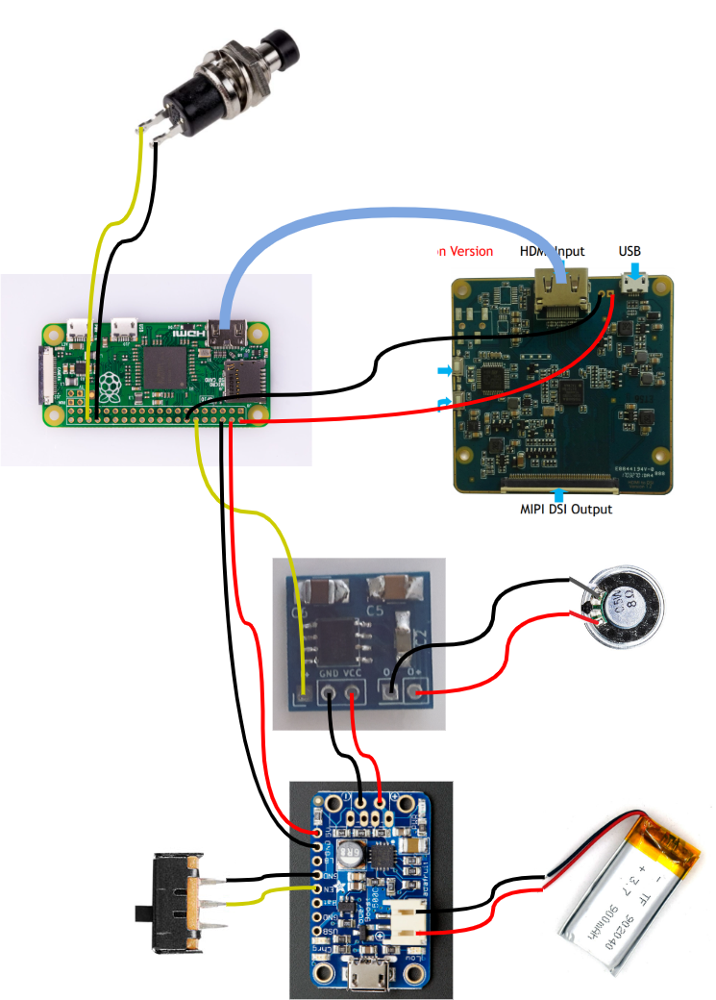

## Fixings
To fix components inside the case I used glue sticks and inserts/screws for some PCBs.
The M3 inserts used are: [Link](https://www.rs-particuliers.com/Product.aspx?Product=278534).

## Case
I have designed the case using Fusion 360.

Here are the files: [case.zip](./case/case.zip)

For a better result I have sent the STL files to [Sculpteo](https://www.sculpteo.com/fr/).

+ Material: SLS (Plastic), Nylon PA12 100-120µ (White)
+ Finition: Polish, White

## Assembly

### Back
1. *Case back*
   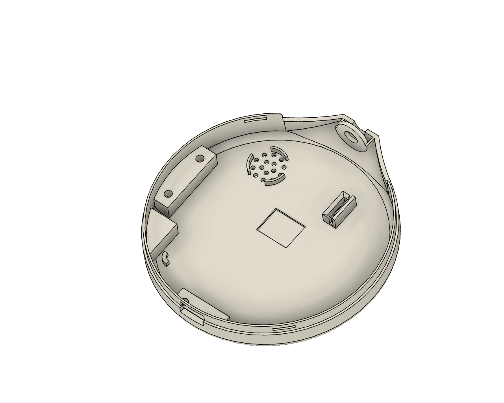

2. *Add push button*
   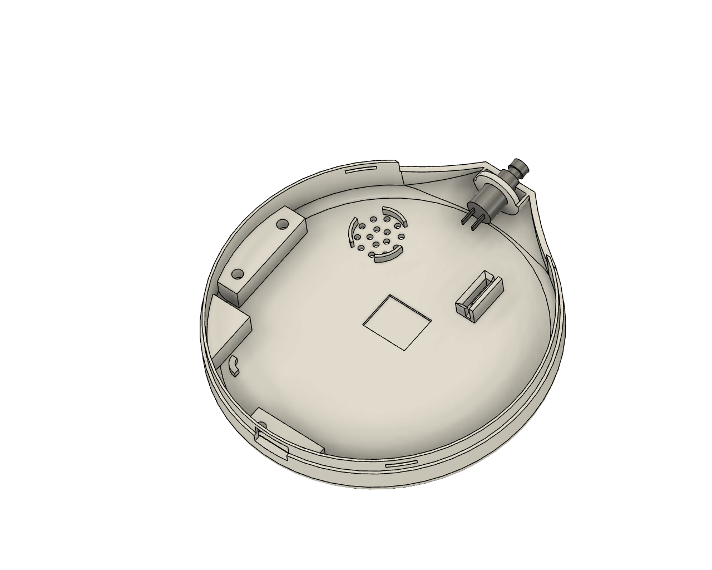

3. *Add power switch*
   

4. *Add LCD driver + HDMI plug*
   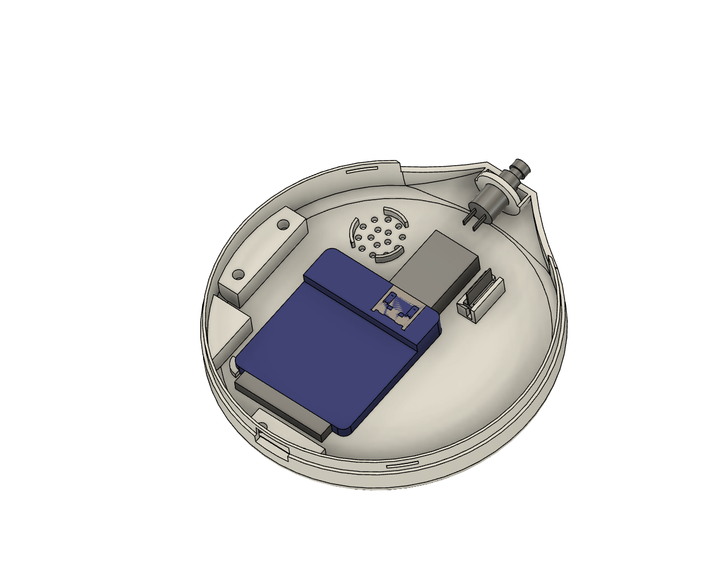

5. *Add battery charger + boost*
   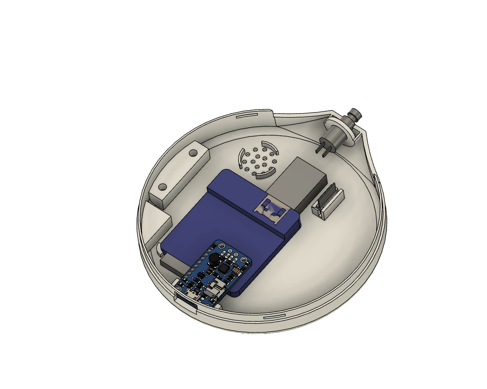

6. *Add Raspberry Pi Zero + HDMI plug*
   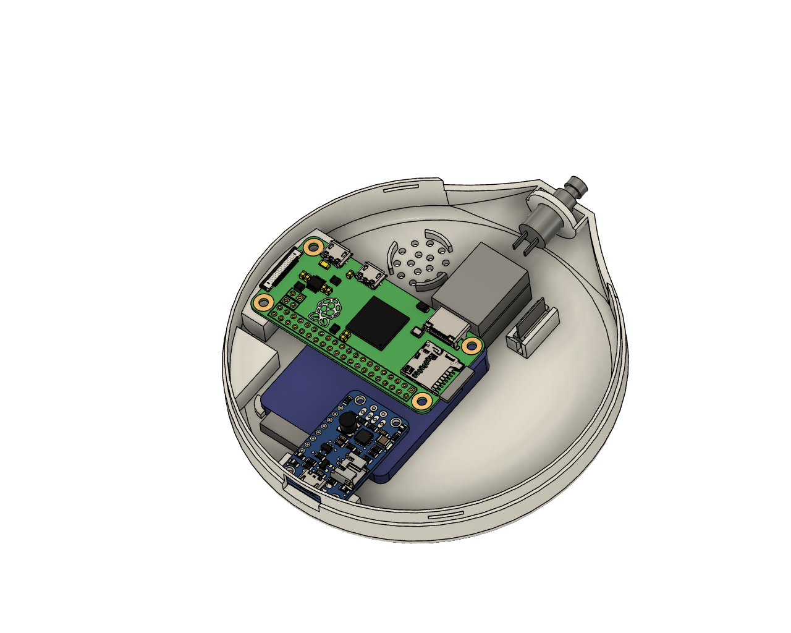

7. *Add audio filter + amplifier*
   

8. *Add speaker*
   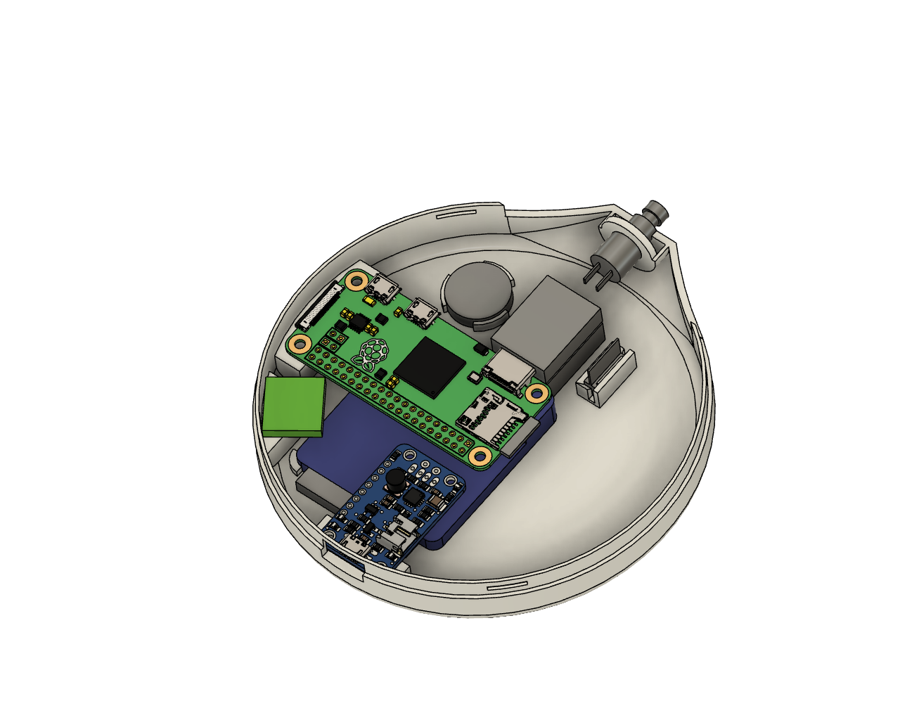

9. *Add battery*
   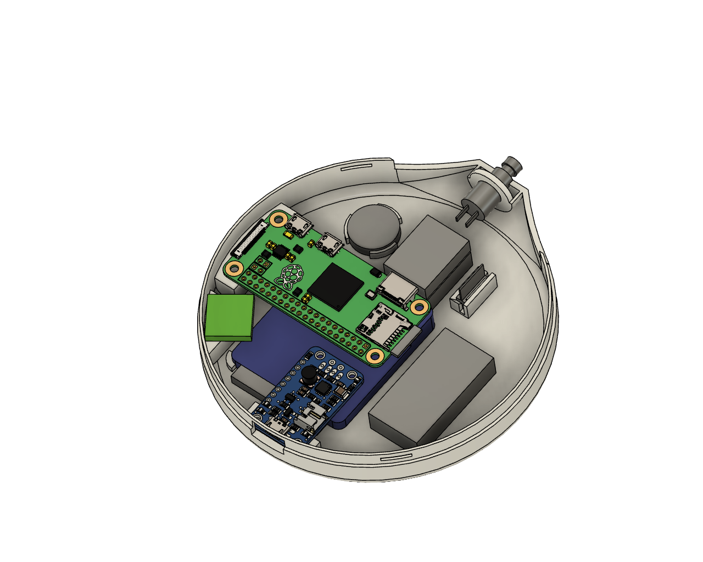

### Front
1. *Case front*
   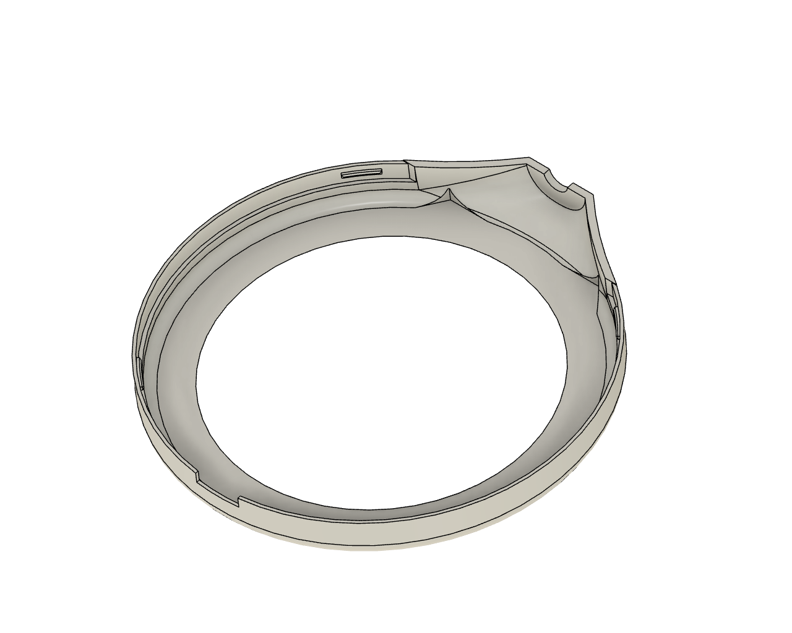

2. *Case front*
   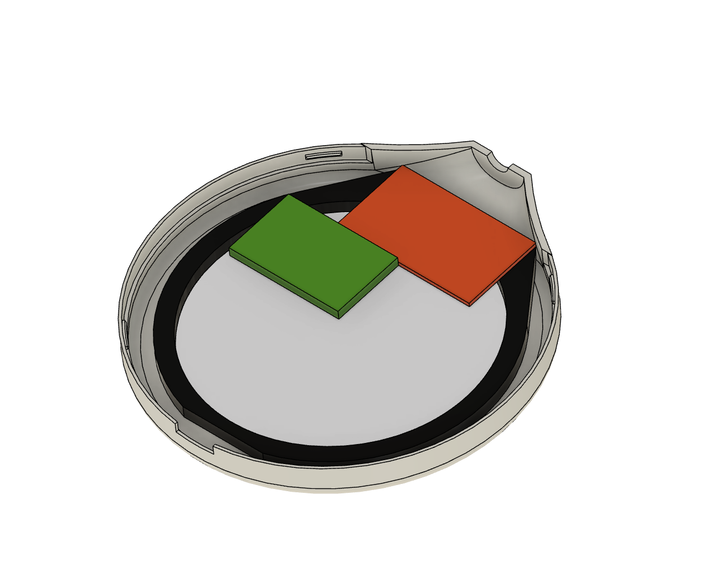

The button cap is simply clipped on the push button.

## Software

For this part there are two different ways:
1. Using Raspberry Pi OS:
   - Install Raspberry Pi OS on the SDCard.
   - Configure the system to send output audio on GPIO 18 (adding dtoverlay=pwm-2chan,pin=18,func=2,pin2=13,func2=4 to /boot/config.txt should do the trick).
   - Add the dragon-radar program, compile it and configure the system to run it start.
   - Configure the system as read only filesystem.

2. Use buildroot to create our own Raspberry Pi Zero image.
    This is more complex but should boot fastest.

I personnaly choose the second way.
